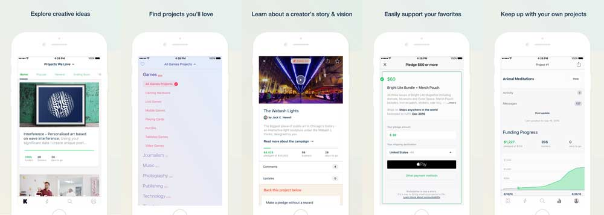

# Kickstarter for iOS

[](https://circleci.com/gh/kickstarter/ios-oss)

Welcome to Kickstarter’s open source iOS app! Come on in, take your shoes off,
stay a while—explore how Kickstarter’s native squad has built and continues to
build the app.

We’ve also open sourced our [Android app](https://github.com/kickstarter/android-oss),
and read more about our journey to open source [here TODO LINK]().



## Getting Started

1. [Download](https://developer.apple.com/xcode/download/) the Xcode 7.3.1 release.
1. Clone this repository.
1. Run `make bootstrap` to install tools and dependencies.
1. Run `make test-all` to build and run tests on all platforms.

## Some fun things to explore

If you’re just looking for a quick glance at a few things we’re particularly
proud of, look no further:

* The [`Screenshots`](https://github.com/kickstarter/ios-oss/tree/readme-update/Screenshots/_64)
directory holds nearly 500 screenshots of various screens in every language,
device and edge-case state that we like to make sure stays true. For example,
a backer viewing a project in French
[here](https://github.com/kickstarter/ios-oss/blob/d33bfbff8dee212eb46328cfcfe64f5aa90afc7b/Screenshots/_64/Kickstarter_Framework_iOSTests.ProjectPamphletContentViewControllerTests/testBacker_LiveProject_lang_fr_device_phone4_7inch%402x.png)
, or a creator looking at their dashboard in German and on an iPad
[here](https://github.com/kickstarter/ios-oss/blob/64f79ce6a03a8fad9b7024a43c17b4ae5f264d31/Screenshots/_64/Kickstarter_Framework_iOSTests.DashboardViewControllerTests/testView_lang_de_device_pad%402x.png).

* We use Swift Playgrounds for [iterative development and styling](https://youtu.be/A0VaIKK2ijM?t=26m47s).
Most major screens in the app get a corresponding playground where we can see a
wide variety of devices, languages and data in real time. Browse our collection of
playgrounds [here](https://github.com/kickstarter/ios-oss/tree/master/Kickstarter-iOS.playground/Pages).

* [We use view models](https://www.youtube.com/watch?v=EpTlqx6NjYo) as
a lightweight way to isolate side effects and embrace a functional core. We
write [these](https://github.com/kickstarter/ios-oss/tree/readme-update/Library/ViewModels)
as a pure mapping of input signals to output signals, and [test](https://github.com/kickstarter/ios-oss/tree/readme-update/Library/Tests/ViewModels)
them heavily, including tests for localization, accessibility and event
tracking.

## Documentation

While we’re at it, why not share our docs? Check out the
[native docs](https://github.com/kickstarter/native-docs) we have written so far
for more documentation.

## Dependencies

We make heavy use of the following projects, and so it can be helpful to be
familiar with them:

### 1st party

* [](https://circleci.com/gh/kickstarter/Kickstarter-Prelude)
[Prelude](https://github.com/kickstarter/Kickstarter-Prelude): Foundation of
types and functions we feel are missing from the Swift standard library.

* [](https://circleci.com/gh/kickstarter/ios-ksapi)
[KsApi](https://github.com/kickstarter/ios-ksapi): Models and reactive
networking layer for fetching data from Kickstarter’s API.

* [](https://circleci.com/gh/kickstarter/Kickstarter-ReactiveExtensions)
[ReactiveExtensions](https://github.com/kickstarter/Kickstarter-ReactiveExtensions):
A collection of operators we like to add to ReactiveCocoa.

### 3rd party

* [AlamofireImage](https://github.com/Alamofire/AlamofireImage)
* [Argo](https://github.com/thoughtbot/Argo)
* [FBSnapshotTestCase](https://github.com/facebook/ios-snapshot-test-case)
* [ReactiveCocoa](https://github.com/ReactiveCocoa/ReactiveCocoa)

## Contributing

We intend for this project to be an educational resource: we are excited to
share our wins, mistakes, and methodology of iOS development as we work
in the open. Our primary focus is to continue improving the app for our users in
line with our roadmap.

The best way to submit feedback and report bugs is to open a GitHub issue.
Please be sure to include your operating system, device, version number, and
steps to reproduce reported bugs. Keep in mind that all participants will be
expected to follow our code of conduct.

## Code of Conduct

We aim to share our knowledge and findings as we work daily to improve our
product, for our community, in a safe and open space. We work as we live, as
kind and considerate human beings who learn and grow from giving and receiving
positive, constructive feedback. We reserve the right to delete or ban any
behavior violating this base foundation of respect.

## License

```
Copyright 2016 Kickstarter, PBC.

Licensed under the Apache License, Version 2.0 (the "License");
you may not use this file except in compliance with the License.
You may obtain a copy of the License at

   http://www.apache.org/licenses/LICENSE-2.0

Unless required by applicable law or agreed to in writing, software
distributed under the License is distributed on an "AS IS" BASIS,
WITHOUT WARRANTIES OR CONDITIONS OF ANY KIND, either express or implied.
See the License for the specific language governing permissions and
limitations under the License.
```
